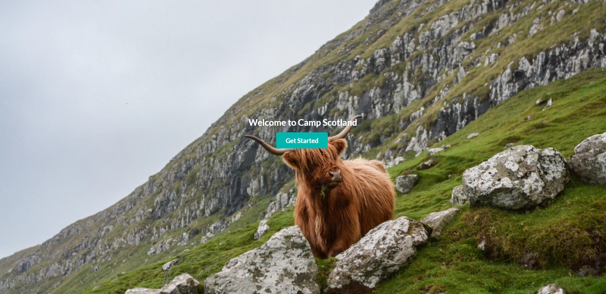

# CampScotland

This project was submitted as my Graded Unit Project for HND Computer Science Year 2. This is purely the practical section of the tnire project, there was accompanying UML, Documentation, Reports, Diagrams etc.

All of which contributed to a massive amount of self-directed learning into Node.JS, MongoDB, Express, REST amongst other things. This project is by no means perfect or complete, however it does demonstrate how far I have come in my Web Development learning since the beginning of the year. 

* All images used have been sourced from Unsplash.
  * [Neist Point Lighthouse by Mike Smith](https://unsplash.com/photos/0FijUNA1GiY)
  * [Quiraing by Bjorn Snelders](https://unsplash.com/photos/Cd3Ek7rNXSk)
  * [Faroe Islands by Eric Welch](https://unsplash.com/photos/XucH5JNRFig)
  * [Luskentyre Beach by Petia Koleva](https://unsplash.com/photos/7SFTCEqrrYg)
  * [Scotland by Henry Paul](https://unsplash.com/photos/aTA_Y5KmAx4)
